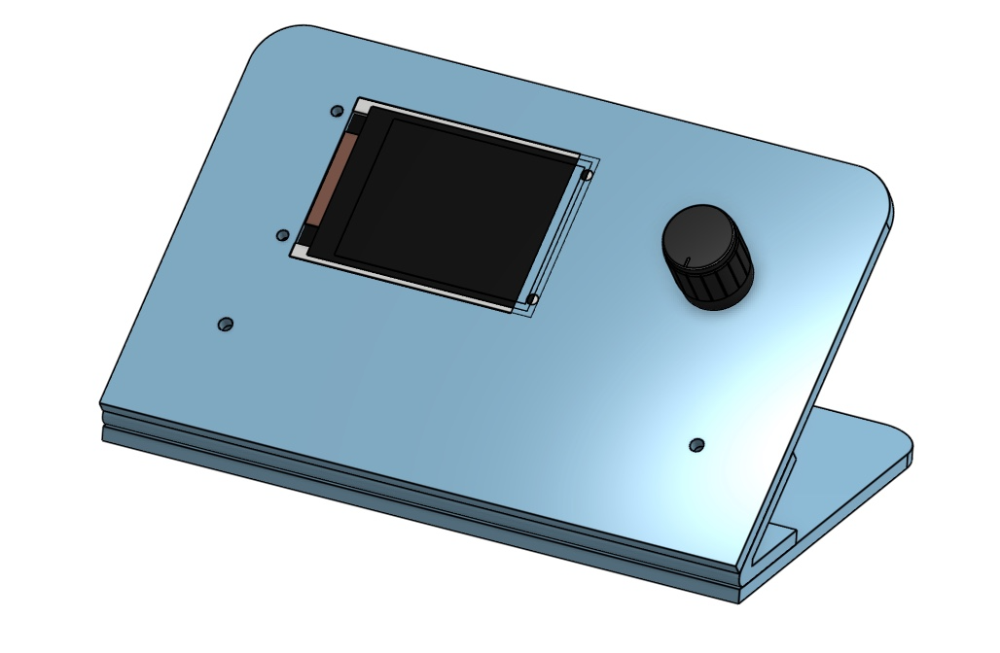
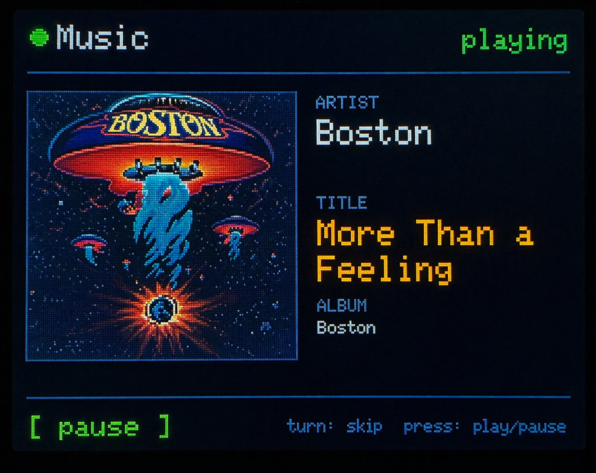
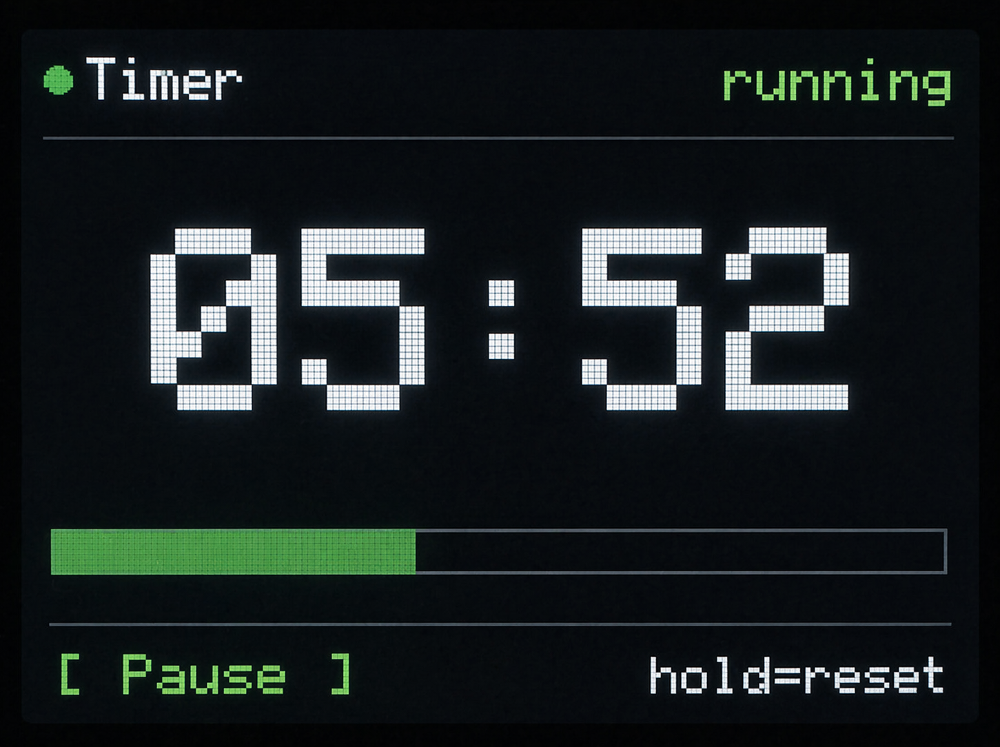
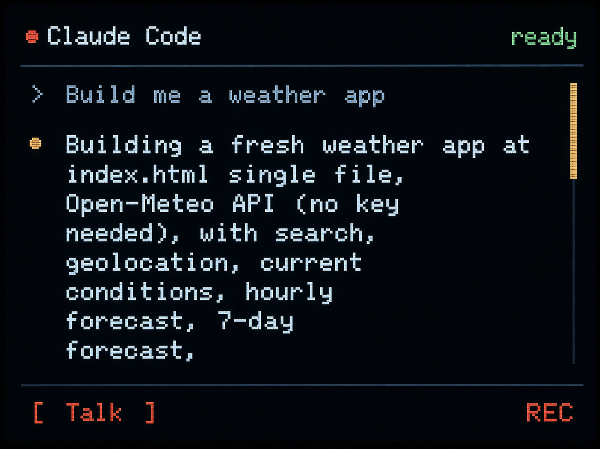

# Mini Deck

**One dial. Infinite control.**  
A tactile controller for your Mac. Music, apps, and live data, at your fingertips.

**[Sign up for the waitlist →](https://tally.so/r/KYPp6V)**

  

---

## What is this?

Mini Deck is a tiny, open-source desktop controller: a dial, a color screen, and an ESP32. Wire it, flash an app, and you're done. Or write your own.

Batch 1 (100 units) ships **July 2026**.

## What can it do?

Anything you can talk to over serial or Wi-Fi. A few starting points:

- **Music player** — turn for volume, press to play/pause, screen shows now-playing artwork.
- **Pomodoro timer** — focus blocks with a live countdown and a progress bar you can see from across the room.
- **Claude Code push-to-talk** — hold the dial to dictate a prompt, release to send. Screen streams the response back.
- **Zoom / Meet mute** — glanceable mic status, one-tap toggle.
- **CI / build status** — green dot good, red dot go look.
- **Stock or crypto ticker** — because why not.
- **Smart home dial** — lights, thermostat, anything Home Assistant exposes.

A handful of reference apps ship with Batch 1 — Music, Pomodoro, and Claude Code push-to-talk to start, with more landing before ship. The rest is up to you! The API and config format are open.

  
  
  

Music · Pomodoro · Claude Code

## Why Mini Deck?

**Dial + screen** on an ESP32‑S3: smooth input, glanceable output. Flash your firmware and pair it with a small host script over **serial** or **HTTP** (Wi‑Fi when you want it off the wire).

- **Open firmware.** Fork the examples, write your own, flash whatever you want.
- **Hackable hardware.** ESP32-S3, standard headers, exposed GPIO. Add buttons, sliders, sensors.
- **~$50 a kit.** One dial, one screen, one board. Ship it or hack it.

## What's in this repo (coming soon)

- `firmware/` — example ESP32 firmware (music player, Pomodoro, Claude Code push-to-talk)
- `wiring/` — wiring diagrams for every supported configuration (encoder, buttons, sliders, sensors)
- `apps/` — reference apps you can fork as a starting point
- `hardware/` — BOM, dimensions, renders
- `docs/` — flashing guide, config format, pinout

Everything lands here as we finalize Batch 1. ⭐ **Star the repo** to get pinged when it drops.

## FAQ

**Do I need a Mac?**  
No, the hardware and firmware are not Mac-specific. Batch 1 ships **Mac-first** docs and reference tooling; Linux should work out of the box, and Windows is untested but nothing in the design blocks it.

**Why ESP32 and not RP2040?**
Wi-Fi and Bluetooth come free. That unlocks a lot of the "live data" use cases without a USB tether.

**Do I need the kit to use the firmware?**
No. Everything in this repo is open. If you have an ESP32-S3, a rotary encoder, and a small display, you can follow the wiring diagrams and flash it yourself. The kit just saves you the sourcing.

**USB-C? Battery?**
USB-C for power and data. No battery in Batch 1 — it's a desktop device.

**Can I add my own buttons / sliders / sensors?**
Yes. Pinout and supported peripherals will be in `docs/` before ship.

**What's 3e8 Systems?**
The team behind it. [3e8systems.com](https://3e8systems.com).

Contact [ari@3e8robotics.com](mailto:ari@3e8robotics.com) for any feedback

## License

- Firmware + examples: **MIT**
- Wiring diagrams + docs: **CC BY 4.0**

---

Built by [3e8 Systems](https://3e8systems.com)